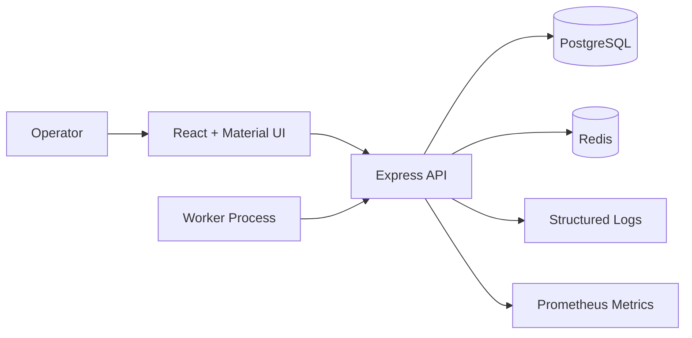

# Architecture

## System Context

The system provides a control plane for creating queues/jobs and a worker API for claiming and reporting execution. PostgreSQL owns all correctness-sensitive state.

## Components

- **Frontend:** authentication, organization/project context, queue/job/worker management, metrics, job details, and DLQ inspection.
- **API:** validation, error mapping, authentication, domain services, health, and metrics.
- **PostgreSQL:** jobs, locks, attempts, execution history, retry availability, schedules, logs, heartbeats, and DLQ.
- **Redis:** connectivity/health dependency reserved for future coordination or caching.
- **Worker runner:** polls while capacity is available, executes jobs concurrently, heartbeats, and drains gracefully.

## Module Boundaries

Backend modules are grouped by domain: `auth`, `users`, `organizations`, `projects`, `queues`, `jobs`, `workers`, `retry`, `dead-letter`, `metrics`, and `health`. Routes validate transport input; services own business operations; repositories are used where persistence abstraction adds value.

## Data Flow

1. An operator creates a job through the frontend or REST API.
2. The job is stored with queue/project ownership, priority, state, and availability timestamps.
3. A worker calls the claim endpoint.
4. PostgreSQL locks a queue/job and creates an execution attempt atomically.
5. The worker marks the attempt running and reports success or failure.
6. Failure schedules retry availability or creates a DLQ entry.
7. Metrics, logs, and job history expose the lifecycle.

## Reliability Decisions

- PostgreSQL, not Redis, decides job ownership.
- Claiming and execution creation share one transaction.
- Queue concurrency is checked while the queue row is locked.
- Heartbeats are historical records; the worker row stores current liveness.
- Job logs are persisted separately from process logs.

## Deployment View

Docker Compose runs PostgreSQL, Redis, backend, and frontend. The backend image uses Debian plus OpenSSL for Prisma compatibility. The frontend image builds static assets and serves them with Vite preview for the assignment environment.

## Known Architecture Gaps

- Full tenant authorization is not enforced across every scheduler route.
- Recurring definitions require a future dispatcher.
- High-volume deployments should partition append-heavy tables and consider partial polling indexes.

---

[GitHub Repository](https://github.com/SujalP21/Distributed-job-scheduler)
