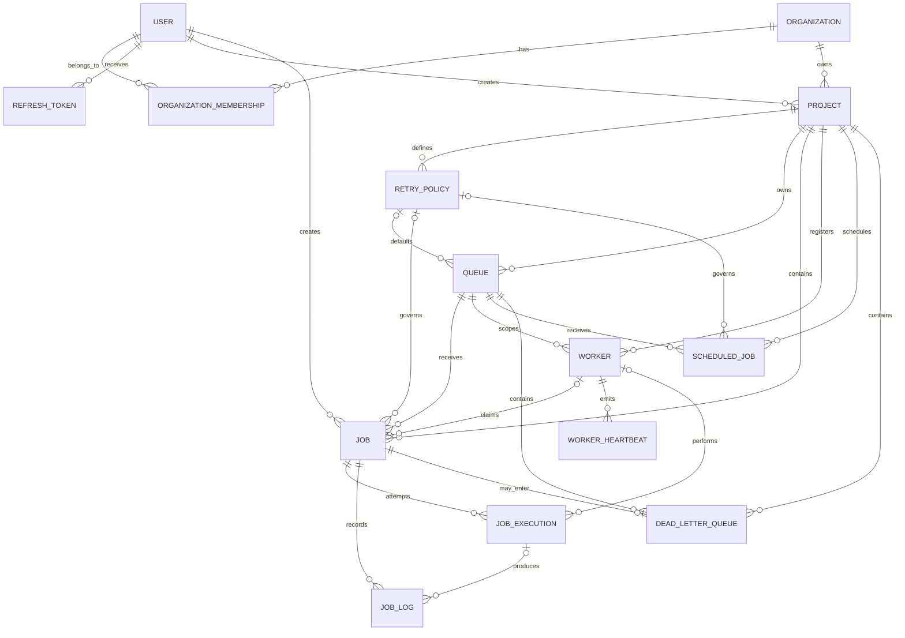

# Entity Relationship Diagram

The detailed key, cascade, normalization, and index rationale is in
[Database Design](DATABASE-DESIGN.md).

---

[GitHub Repository](https://github.com/SujalP21/Distributed-job-scheduler)
