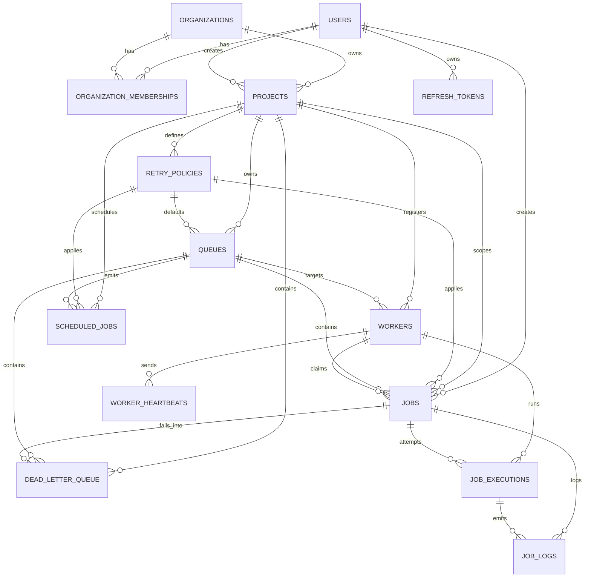

# ER Diagram

```mermaid
erDiagram
  USERS ||--o{ ORGANIZATION_MEMBERSHIPS : has
  ORGANIZATIONS ||--o{ ORGANIZATION_MEMBERSHIPS : has
  ORGANIZATIONS ||--o{ PROJECTS : owns
  USERS ||--o{ PROJECTS : creates
  USERS ||--o{ REFRESH_TOKENS : owns
  USERS ||--o{ JOBS : creates
  PROJECTS ||--o{ RETRY_POLICIES : defines
  PROJECTS ||--o{ QUEUES : owns
  PROJECTS ||--o{ JOBS : scopes
  PROJECTS ||--o{ WORKERS : registers
  PROJECTS ||--o{ SCHEDULED_JOBS : schedules
  PROJECTS ||--o{ DEAD_LETTER_QUEUE : contains
  RETRY_POLICIES ||--o{ QUEUES : defaults
  RETRY_POLICIES ||--o{ JOBS : applies
  RETRY_POLICIES ||--o{ SCHEDULED_JOBS : applies
  QUEUES ||--o{ JOBS : contains
  QUEUES ||--o{ WORKERS : targets
  QUEUES ||--o{ SCHEDULED_JOBS : emits
  QUEUES ||--o{ DEAD_LETTER_QUEUE : contains
  WORKERS ||--o{ WORKER_HEARTBEATS : sends
  WORKERS ||--o{ JOB_EXECUTIONS : runs
  WORKERS ||--o{ JOBS : claims
  JOBS ||--o{ JOB_EXECUTIONS : attempts
  JOBS ||--o{ JOB_LOGS : logs
  JOB_EXECUTIONS ||--o{ JOB_LOGS : emits
  JOBS ||--o| DEAD_LETTER_QUEUE : fails_into
```
