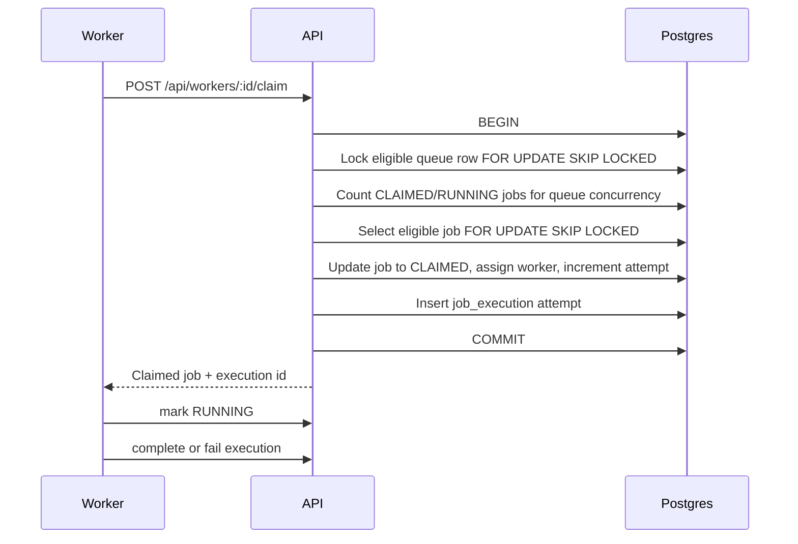

# Worker Claim Sequence

The queue row lock serializes concurrency checks per queue. The job row lock prevents duplicate claims while allowing other workers to skip locked rows and continue polling.
